

  <a href="#-tecnologias">Tecnologias</a>&nbsp;&nbsp;&nbsp;|&nbsp;&nbsp;&nbsp;
  <a href="#-projeto">Projeto</a>&nbsp;&nbsp;&nbsp;|&nbsp;&nbsp;&nbsp;
  <a href="#-como-rodar">Como rodar</a>&nbsp;&nbsp;&nbsp;|&nbsp;&nbsp;&nbsp;
  <a href="#-como-contribuir">Como contribuir</a>&nbsp;&nbsp;&nbsp;
  

 

# To Do List With Java

## 🚀 Tecnologias

Esse projeto foi desenvolvido com as seguintes tecnologias:

- [Npm](https://www.npmjs.com/) - 8.19.2
- [Java](https://www.java.com/pt-BR/) - 19.0.2
- [Maven](https://maven.apache.org/)
- [Spring Initializr](https://start.spring.io/)
- [Insomnia](https://insomnia.rest/download)

## 💻 Projeto

Projeto de uma to do list desenvolvida com Java e usando Rest Client para fazer as requisições das rotas.

Evento do Curso de Java na plataforma da [Rocketseat](https://www.rocketseat.com.br/).

## 🚀 Como Rodar

- Clone o projeto.
- Entre na pasta do projeto e rode 'npm install' (use 'yarn install' se for essa a sua configuração).
- Entre no arquivo TodolistApplication.java e clique em 'Run' (para rodar o spring boot).
-

## 👩🏿‍💻 Rotas

- **`POST /users`**: Rota para criação de usuários:

Envia:

  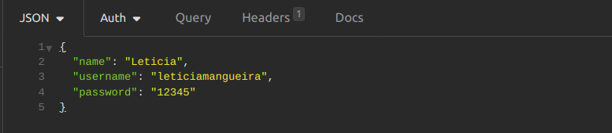

Retorna:

  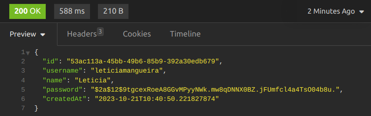

- **`POST /tasks`**: Rota para criar a tarefa com o usuário logado:

Usuário:

  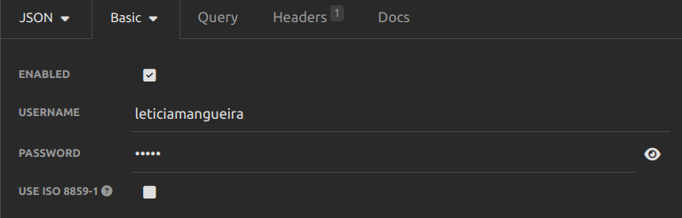

Envia:

  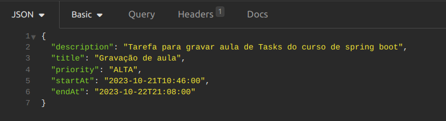

Retorna:

  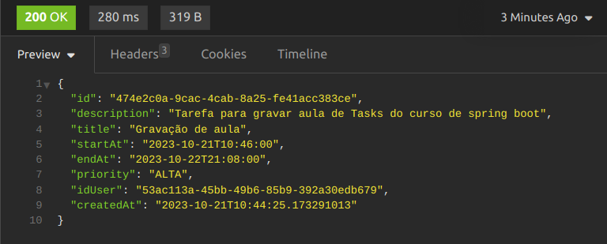

- **`GET /tasks`**: Rota para listar as tarefas do usuário logado (enviar os dados no corpo da requisição):

Usuário:

  

Envia:

  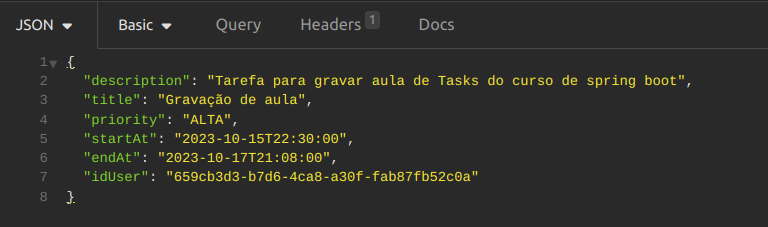

Retorna:

  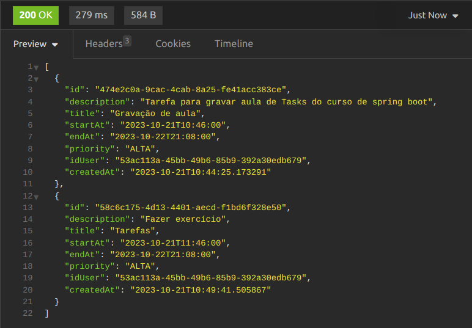

- **`PUT /tasks/{idTask}`**: Rota para atualizar uma tarefa do usuário logado:

Envia:

  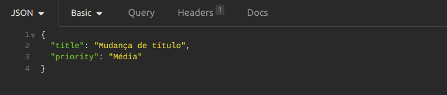

Retorna:

  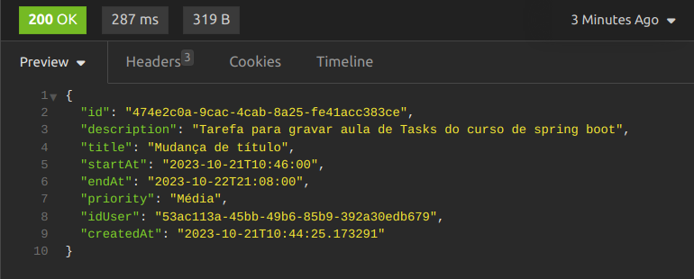

- **`POST /tasks`**: Se não tiver criado um usuário e tentar criar uma tarefa:

  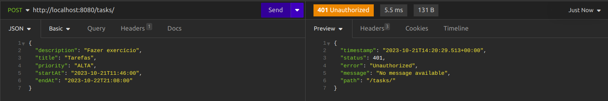

- **`PUT /tasks/{idTask}`**: Se tentar alterar uma tarefa de um outro usuário:

Usuário:

  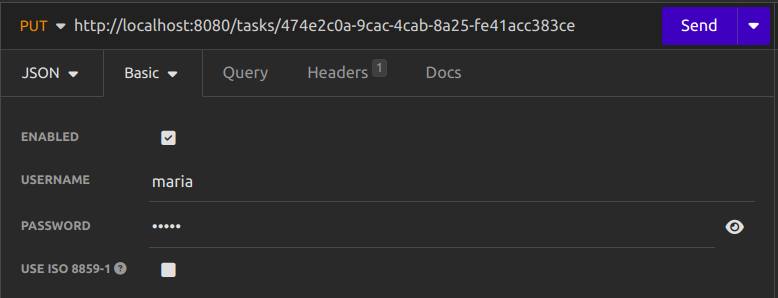

  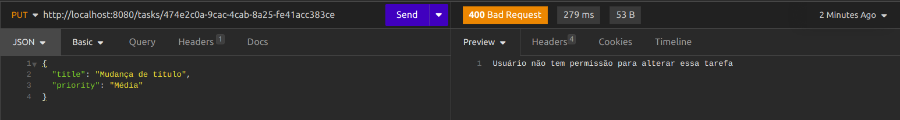

## 🤔 Como contribuir

- Faça um fork desse repositório;
- Cria uma branch com a sua feature: `git checkout -b minha-feature`;
- Faça commit das suas alterações: `git commit -m 'feat: Minha nova feature'`;
- Faça push para a sua branch: `git push origin minha-feature`.

Depois que o merge da sua pull request for feito, você pode deletar a sua branch.

## 📝 Licença

Esse projeto está sob a licença MIT.
